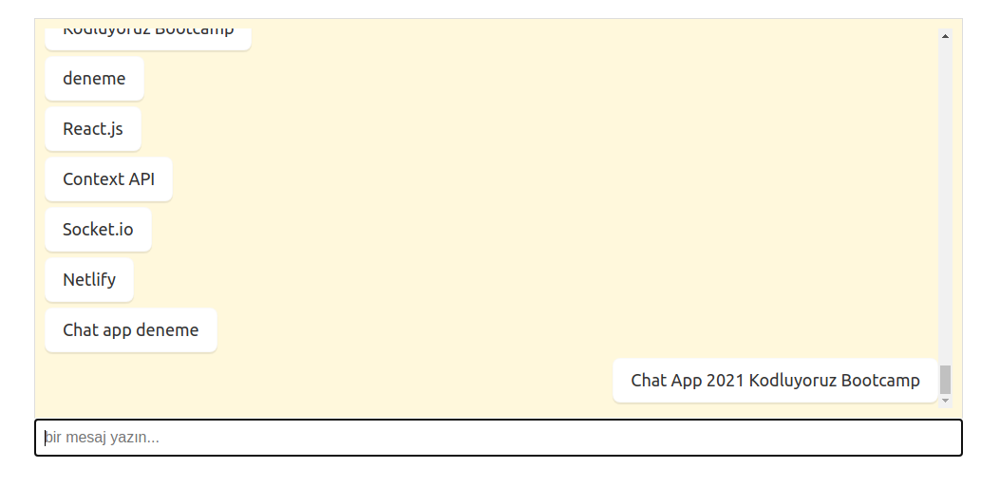

## Patika | React | Chat-App
* redis backend with socket.io
* react frontend
* context api for state management

### How to run
redis for mac:
```bash
brew install redis

brew services start redis

redis-cli
```
or:
* [follow this ](https://redis.io/docs/getting-started/installation/install-redis-on-mac-os/)

redis for windows:
* [follow these steps ](https://redis.io/docs/getting-started/installation/install-redis-on-windows/)

### How to run backend

```bash
cd backend/
npm install
npm start
```

### How to run frontend

```bash
cd client/
npm install
npm start
```
### Production Image

